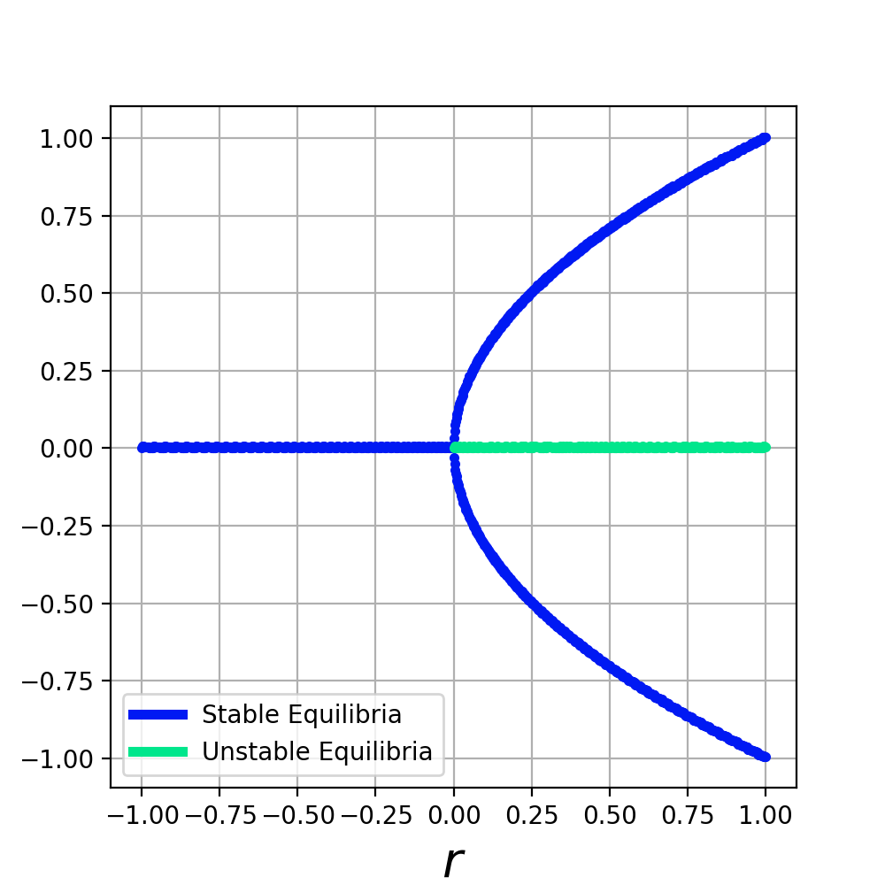
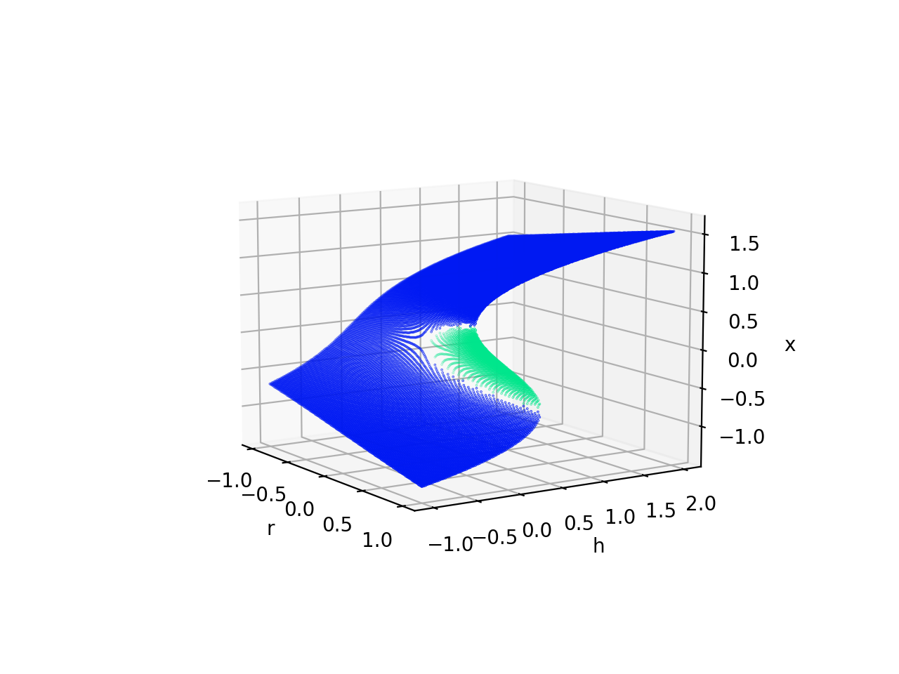
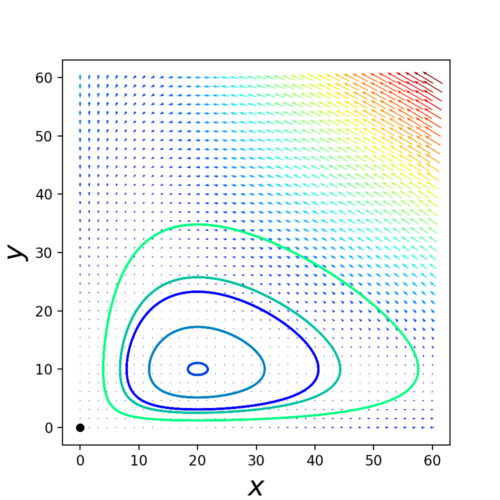
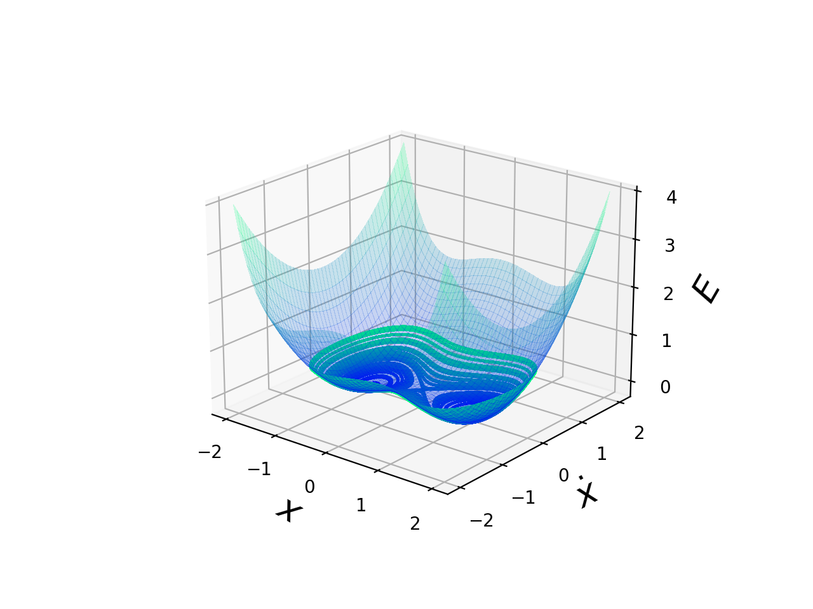

# Nonlinear Dynamical Systems Visualization Code

This is a set of python codes for visualizing 1-D and 2-D dynamical systems, both
linear and nonlinear. These were originally coded to visualize various systems
described in [1].

Example outputs include:
 - __Bifurcation Diagrams__
  

 - __Stability Diagrams__
 

 - __Phase Diagrams__
  

- __Energy Surfaces__
   

__More to come!!__

## References

 [1] S. Strogatz, _Nonlinear Dynamics and Chaos, 2nd. Ed._, Westview Press,
     Philadelphia, PA, 2015.

## Requirements
  - `python 3.6`
  - `numpy`
